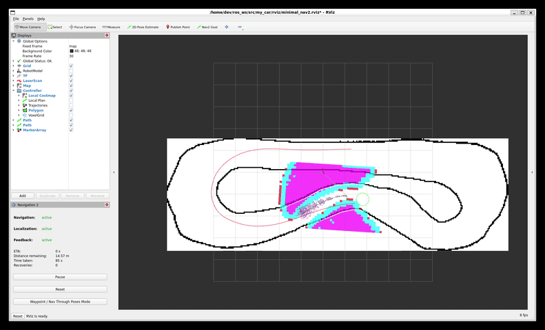

# **Nav2 MPPI controller use in F1TENTH Sim racing league**

### Demo

<table>
  <tr>
    <td align="center"><a href="https://www.youtube.com/watch?v=0iHc1kHdg5M"></a></td>
    <td align="center"></td>
    <td align="center"></td>
  </tr>
  <tr>
    <td align="center">Youtube clip</td>
    <td align="center">Simulator gif</td>
    <td align="center">RViz gif</td>
  </tr>
</table>
 


In this project we experiment using the Nav2 MPPI controller in the f1tenth sim racing league.  
This is MPPI contoller is one of several implemented in the Nav2 stack developed above ROS2.  

### Nav2 related sources  
[Nav2 documentation](https://docs.nav2.org/index.html)  
[Nav2 overview in ROSCon 2019](https://vimeo.com/378682188)  

### Nav2 MPPI controller related sources  
[Nav2 MPPI](https://docs.nav2.org/configuration/packages/configuring-mppic.html)  
[Nav2 MPPI overview in ROSCon 2023](https://vimeo.com/879001391)  

### F1TENTH sim racing league  
The main page of sim racing league can be found [here](https://autodrive-ecosystem.github.io/competitions/f1tenth-sim-racing-cdc-2024/)  
The technical guide to get started and run the simulator + devkit container can be found [here](https://autodrive-ecosystem.github.io/competitions/f1tenth-sim-racing-guide/)  

Detailed documentation on what was done and what can be done next, see the pdf in repo [here](./race_car_project_report.pdf)

### What's in our repo?
This repo was used as internal git repository in docker container and should be pulled at start to its latest (unless a docker image version is commited and pushed).  
The docker hub repository for the image can be found [here](https://hub.docker.com/repository/docker/ynahum/ad_f1_api/general). Take the latest (currently mppi3 tag).
📝 **Note:** Once you want to compete and start automatically the car, you'll need to create a docker image with built ROS2 packages and change the script that runs at start to invoke your main ./run script.  

### Getting started

1. Start by getting the docker image and running it as follows:
```bash
docker run --name autodrive_f1tenth_api --rm -it --entrypoint /bin/bash --network=host --ipc=host \
 -v /tmp/.X11-unix:/tmp/.X11-unix:rw --env DISPLAY="$DISPLAY" --privileged ynahum/ad_f1_api:mppi_3
```

2. Once in the running container shell, get to the main source directory of our ROS2 workspace by running:  
```bash
wa
```  
&nbsp;&nbsp;&nbsp;&nbsp;This will change the directory as follows:
```bash
root@ynahum-mobl1:/home/autodrive_devkit# wa
root@ynahum-mobl1:/home/dev/ros_ws/src#
```

3. git pull the git repo (if not already latest in your docker image version)  
```bash
git pull
```

4. Next, we need to build the workspace (if not built in our docker image)
```bash
./build.sh
```
&nbsp;&nbsp;&nbsp;&nbsp;The output should look as follows:
```bash
root@ynahum-mobl1:/home/dev/ros_ws/src# ./build.sh 
Starting >>> my_car  
Finished <<< my_car [0.18s]                     

Summary: 1 package finished [0.30s]
Starting >>> nav2_bt_navigator
Finished <<< nav2_bt_navigator [0.17s]                     

Summary: 1 package finished [0.29s]
Starting >>> nav2_mppi_controller
Finished <<< nav2_mppi_controller [13.2s]                       

Summary: 1 package finished [13.3s]
root@ynahum-mobl1:/home/dev/ros_ws/src#
```
5. Run the simulator on the host machine (there are different versions with different race tracks.  
6. Run the devkit bridge and our car's ROS2 components by:  
```bash
./run.sh
```

At this stage, you should see the Rviz getting opened. If the simulator runs "headless" (meaning no GUI), the bridge will connect automatically to the simulator and the car should start driving.  Otherwise, if the simualtor is opened with its graphics, you should press the connect button on it, the bridge will start passing the data to the topics and the car will start driving.  
